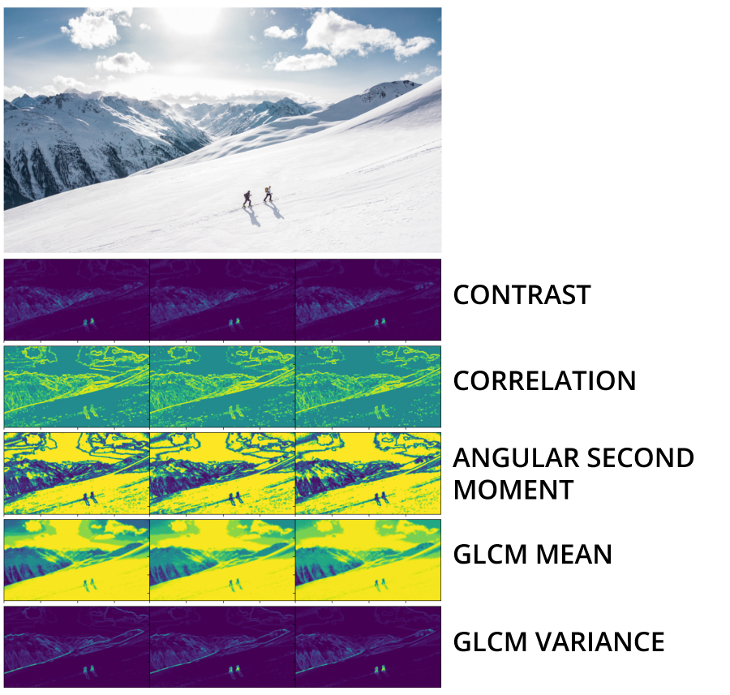

# Binned Cython 5 Feature GLCM



[**Photo by Flo Maderebner from Pexels**](https://www.pexels.com/@fmaderebner)

```
pip install glcmbin5
```

## Motivation

There are 2 main improvements, speed and memory size

### Speed

This is **several magnitudes** faster than using ``skimage.feature.graycomatrix`` and ``graycoprops``
because this is Cython optimized.

With a *2000x1000x3* image, it takes around 2 minutes.
Compared to a few hours with ``skimage``

```
GLCM Progress: 100%|██████████| 12/12 [02:27<00:00, 12.30s/it]
```

### Memory Size

If you don't *bin* the array before calculating GLCM, you'll end up with an extremely
large GLCM.

With this algorithm, I omit generating the whole GLCM, instead, it's integrated in
the GLCM feature calculation. Memory used is freed asap. 

Plus, decreasing the GLCM size improves performance significantly.

## Example

You can also see an example in [`/examples`](https://github.com/Eve-ning/glcm/tree/master/examples)

```python
from glcm.glcm import CyGLCM
import numpy as np
ar = ...
glcm = CyGLCM(ar.astype(np.float32),
              radius=3,
              bins=8,
              pairs=('H', 'V', 'SE', 'NE')
              ).create_glcm()
```

## Arguments

- **radius**: The radius of the GLCM window
- **bins**: The number of bins to use
- **pairs**:
  - **H**: Horizontal Pair
  - **V**: Vertical Pair
  - **SE**: South-East Diagonal Pair
  - **NE**: North-East Diagonal Pair

## I/O

**Input**:
- `ndim = 3`
- `shape=(in_dim0, in_dim1, channel)`

**Output**:
- `ndim = 4`
- `shape=(in_dim0, in_dim1, channel, features)`
- Methods:
  - Contrast 
  - Correlation
  - Angular Second Moment
  - GLCM Mean
  - GLCM Variance

## Progress Bar

The progress bar value is the current pair calculated.

## Gotchas

### GLCM Shrink

The resulting GLCM array will be smaller than the original.

*GLCM Dimension = Dimension - (2 * radius + 1) = Dimension - Diameter*

The + 1 comes from the pairing.

### Data Type `float32`

Arrays **MUST BE** in ``np.float32``, you need to cast it.
```
ar.astype(np.float32)
```

## Features

Based on [GLCM Texture: A Tutorial v. 3.0 March 2017](https://prism.ucalgary.ca/handle/1880/51900).

For an effective segmentation, we just need 5 features as selected here.

Many features are not significantly orthogonal, hence more will introduce redundancy.

Chosen methods are for simplicity and efficiency in coding. 

## Binning

Arrays are **Binned** before going through GLCM.

All arrays will be processed to integer values `[0,bin-1]` band-independently.

# Custom Cython Build

Run this command with the `c_setup.py` here
```
python c_setup.py build_ext --inplace
```

# What's the magic?

There are several optimizations

1) It's written mainly in Cython (with little required Python calls)
2) Binning before running the GLCM decreases required GLCM calls

# Citation

If you have used or referenced any of the code in the repository,
please kindly cite

```
@misc{glcmbin5,
  author = {John Chang},
  title = {Binned Cython 5 Feature GLCM},
  year = {2021},
  publisher = {GitHub},
  journal = {GitHub Repository},
  howpublished = {\url{https://github.com/Eve-ning/glcm}},
}
```

# Acknowledgements

- [Dr. Ji-Jon Sit](https://dr.ntu.edu.sg/cris/rp/rp00175) for hosting the parent project [`Eve-ning/FRModel`](https://github.com/Eve-ning/FRModel) which lead to this algorithm
- [Wang Ji Fei](https://fass.nus.edu.sg/geog/people/wang-jifei/) for discovering GLCM Binning optimization.
- [GLCM Texture: A Tutorial v. 3.0 March 2017](https://prism.ucalgary.ca/handle/1880/51900) for providing a
simple tutorial to guide this implementation.
